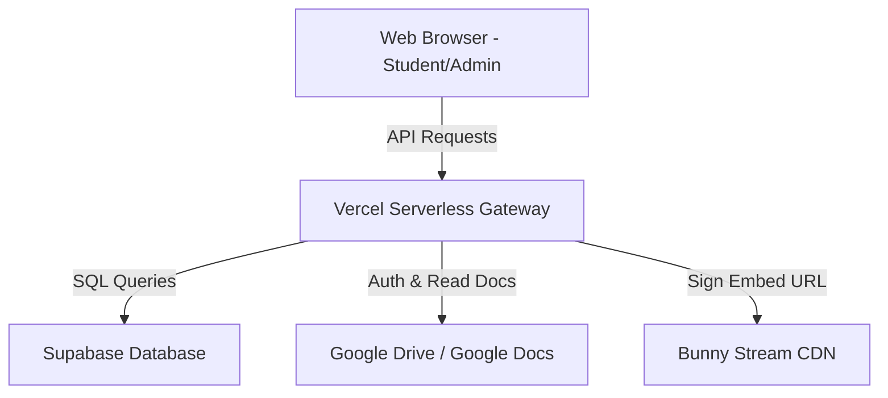
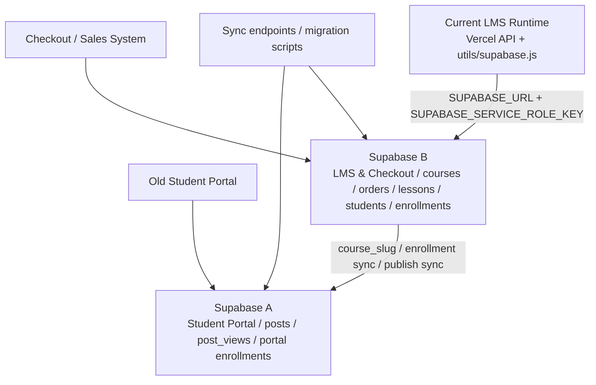

# Project Handover: ARCHITECTURE.md

This document maps out the system architecture and data flows of the Culinary Academy LMS platform.

---

## 1. System Components

### 1.1. Frontend
- **Framework**: No client-side framework (React/Vue/Next.js) is used for rendering. It relies entirely on native HTML5 and Vanilla ES6 JavaScript for fast load times.
- **Client Auth**: Integrates the Google GSI SDK (`accounts.google.id`) to fetch Google OAuth tokens.

### 1.2. Backend
- **Framework**: Vercel Serverless Functions written in Node.js.
- **API Routing**: Configured in `vercel.json` to route `/api/lms/*` endpoints to specific files:
  - `/api/lms/portal` -> `api/lms/portal.js` (Student-facing APIs)
  - `/api/lms/admin` -> `api/lms/admin.js` (Admin CRUD APIs)

### 1.3. Database (Supabase)
- **Engine**: PostgreSQL database.
- **Runtime client in this repo**: Current source code only shows one runtime Supabase client, created in `utils/supabase.js` from:
  - `SUPABASE_URL`
  - `SUPABASE_SERVICE_ROLE_KEY`
- **Important operating note**: Do not conclude that the operating system has only one Supabase database. The project owner has confirmed there are two Supabase/database systems in the broader architecture. This repo may point to one of them depending on runtime env.
- **Key Tables for the current LMS runtime client**:
  - `lessons`: Stores sections and actual lessons. Important columns:
    - `id` (UUID): Primary key.
    - `course_slug` (text): Course grouping key.
    - `lesson_no` (integer): Sequential unique index.
    - `is_section` (boolean): `true` for chapters, `false` for real lessons.
  - `student_enrollments`: Stores email whitelists mapped to course slugs.
  - `site_config`: Key-value pairs for general settings and course configuration.

---

## 1.4. Two-Supabase Operating Architecture

The repo currently exposes one Supabase client at runtime, but the real operating architecture has two Supabase/database systems.

### Supabase A - Student Portal / Old Portal / Auxiliary Portal
- **Org**: `thienha100022653824678-stack's Org`
- **Purpose**:
  - Old student portal / post-based content.
  - Stores recipes or lessons as posts.
  - Tracks post views.
  - Grants portal access by `email` + `course_slug`.
  - Uses `course_slug` to connect portal content with course systems.
- **Known tables / structures**:
  - `posts`: `id`, `title`, `recipe`, `images`, `views`, `created_at`, `telegram_chat_id`, `original_channel_name`, `course_slug`, `status`
  - `post_views`: `post_id`, `session_id`, `ip_address`, `user_agent`, `country`, `city`, `viewed_at`
  - `student_enrollments`: `email`, `course_slug`, `status`, `course_name`, `thumbnail`
- **Known database function**: `record_view(...)` records post views.
- **Known migrations**:
  - A migration explicitly refers to `Supabase A (Student Portal)`.
  - A migration adds `posts.status`.
  - A migration adds `courses.is_published` on both Supabase A and Supabase B.

### Supabase B - LMS & Checkout / Sales + LMS
- **Org**: `thienha336501903-a11y's Org`
- **Purpose**:
  - Checkout / sales / course registration.
  - Manages `courses` and `orders`.
  - Manages LMS `lessons`, `students`, and `student_enrollments`.
  - Uses `lessons.is_section` for chapter/section records.
  - Uses `lessons.materials` for attached learning documents.
  - Tracks sync state through `sync_lms_status`, `sync_portal_status`, and `sync_error`.
  - May be the source or target for the current LMS runtime depending on env.
- **Known tables / structures**:
  - `courses`: `slug`, `title`, `price`, `image_url`, `description`, `teacher_name`, `active`, `is_published`, `sync_lms_status`, `sync_portal_status`, `sync_error`
  - `orders`: `course_slug`, `course_title`, `customer_name`, `customer_email`, `customer_phone`, `proof_image_url`, `status`, `sync_lms_status`, `sync_portal_status`, `sync_error`
  - `lessons`: `course_id`, `course_slug`, `lesson_no`, `title`, `description`, `video_provider`, `video_url`, `bunny_library_id`, `bunny_video_id`, `recipe_url`, `document_url`, `photo_url`, `thumbnail_url`, `duration_text`, `level`, `media_urls`, `views`, `is_free`, `active`, `status`, `sort_order`, `is_section`, `materials`
  - `students`
  - `student_enrollments`
  - `site_config`
  - `lesson_progress`
  - `posts` legacy / sub-course integration

### Supabase Data Flow Map

Before changing code, determine whether the change affects Supabase A, Supabase B, the sync boundary between A and B, or only this repo's current runtime Supabase client.

The current production runtime Supabase project must be confirmed from Vercel env or dashboard before any database-sensitive change. Do not print secret values while confirming it.

---

## 2. Authentication Flow

1. Student opens the page and clicks **Sign In with Google**.
2. Client-side Google SDK returns a JWT credential token.
3. Client posts this token to the Vercel API.
4. Vercel backend validates the token using `google-auth-library`.
5. After validation, Vercel queries Supabase to check if the student's email has an active enrollment (`status = 'active'`) for the target course.
6. If enrolled, the backend generates a signed JWT session cookie (`course_session_token`) and returns success.
7. Subsequent visits load automatically using the saved cookie.

---

## 3. Lesson Loading & Indexing Data Flow

1. Browser requests a lesson details: `GET /api/lms/portal?endpoint=lesson&id=<lesson_uuid>`.
2. Vercel verifies the session token cookie.
3. Vercel queries Supabase for the lesson record.
4. Vercel queries all active siblings of the same course ordered by `lesson_no` to compute the correct `displayLesson` index.
5. Vercel uses the service account to fetch raw recipe texts from Google Docs if `recipe_url` is specified.
6. Vercel signs the Bunny Stream CDN video url using an HMAC token to prevent external sharing.
7. Formatted JSON payload is returned to the client and rendered.
