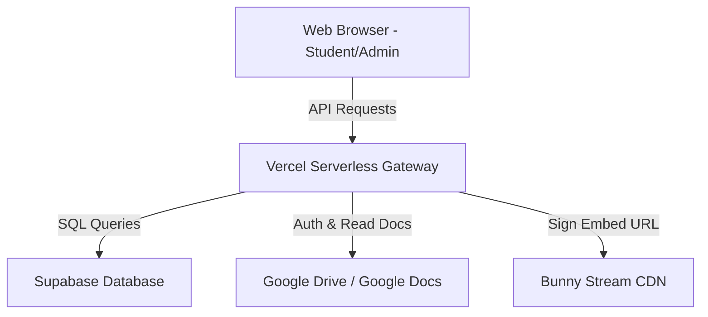

# Project Handover: ARCHITECTURE.md

This document maps out the system architecture and data flows of the Culinary Academy LMS platform.

---

## 1. System Components

### 1.1. Frontend
- **Framework**: No client-side framework (React/Vue/Next.js) is used for rendering. It relies entirely on native HTML5 and Vanilla ES6 JavaScript for fast load times.
- **Client Auth**: Integrates the Google GSI SDK (`accounts.google.id`) to fetch Google OAuth tokens.

### 1.2. Backend
- **Framework**: Vercel Serverless Functions written in Node.js.
- **API Routing**: Configured in `vercel.json` to route `/api/lms/*` endpoints to specific files:
  - `/api/lms/portal` -> `api/lms/portal.js` (Student-facing APIs)
  - `/api/lms/admin` -> `api/lms/admin.js` (Admin CRUD APIs)

### 1.3. Database (Supabase)
- **Engine**: PostgreSQL database.
- **Key Tables**:
  - `lessons`: Stores sections and actual lessons. Important columns:
    - `id` (UUID): Primary key.
    - `course_slug` (text): Course grouping key.
    - `lesson_no` (integer): Sequential unique index.
    - `is_section` (boolean): `true` for chapters, `false` for real lessons.
  - `student_enrollments`: Stores email whitelists mapped to course slugs.
  - `site_config`: Key-value pairs for general settings and course configuration.

---

## 2. Authentication Flow

1. Student opens the page and clicks **Sign In with Google**.
2. Client-side Google SDK returns a JWT credential token.
3. Client posts this token to the Vercel API.
4. Vercel backend validates the token using `google-auth-library`.
5. After validation, Vercel queries Supabase to check if the student's email has an active enrollment (`status = 'active'`) for the target course.
6. If enrolled, the backend generates a signed JWT session cookie (`course_session_token`) and returns success.
7. Subsequent visits load automatically using the saved cookie.

---

## 3. Lesson Loading & Indexing Data Flow

1. Browser requests a lesson details: `GET /api/lms/portal?endpoint=lesson&id=<lesson_uuid>`.
2. Vercel verifies the session token cookie.
3. Vercel queries Supabase for the lesson record.
4. Vercel queries all active siblings of the same course ordered by `lesson_no` to compute the correct `displayLesson` index.
5. Vercel uses the service account to fetch raw recipe texts from Google Docs if `recipe_url` is specified.
6. Vercel signs the Bunny Stream CDN video url using an HMAC token to prevent external sharing.
7. Formatted JSON payload is returned to the client and rendered.
